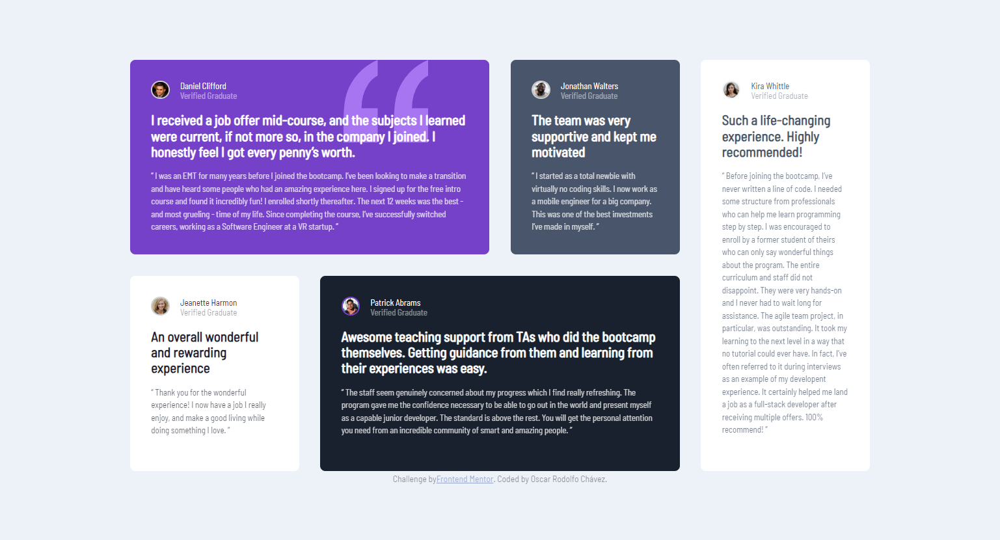
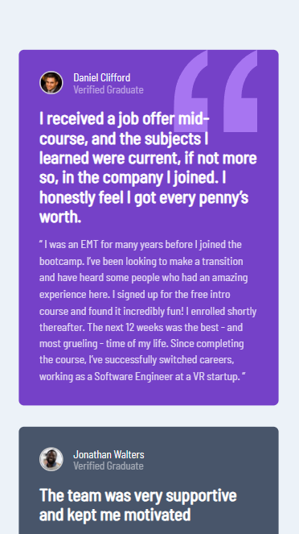
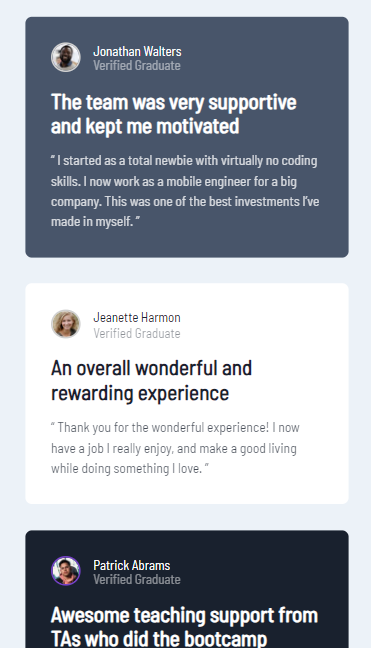

# Frontend Mentor - Testimonials grid section solution

This is a solution to the [Testimonials grid section challenge on Frontend Mentor](https://www.frontendmentor.io/challenges/testimonials-grid-section-Nnw6J7Un7). Frontend Mentor challenges help you improve your coding skills by building realistic projects. 

## Table of contents

- [Overview](#overview)
  - [The challenge](#the-challenge)
  - [Screenshot](#screenshot)
  - [Links](#links)
- [My process](#my-process)
  - [Built with](#built-with)
  - [Useful resources](#useful-resources)
- [Author](#author)

## Overview

### The challenge

Users should be able to:

- View the optimal layout for the site depending on their device's screen size

### Screenshot

Desk

Mobile

### Links

- Solution URL: [Frontend Mentor](https://your-solution-url.com)
- Live Site URL: [GitHub Pages](https://)

## My process

### Built with

- Semantic HTML5 markup
- CSS custom properties
- SASS
- Flexbox
- CSS Grid
- Mobile-first workflow

### Useful resources

- [Flex](https://medium.com/@MakeComputerScienceGreatAgain/understanding-flexbox-a-comprehensive-guide-992bcd5f04de) - This is an amazing article which helped me understand Flexbox

- [Grid](https://grid.malven.co) 

- [Grid-Generator](https://cssgrid-generator.netlify.app)

- [SASS](https://sass-lang.com/guide/)

## Author

- Frontend Mentor - [@OscarRodolfoUMG](https://www.frontendmentor.io/profile/OscarRodolfoUMG)
